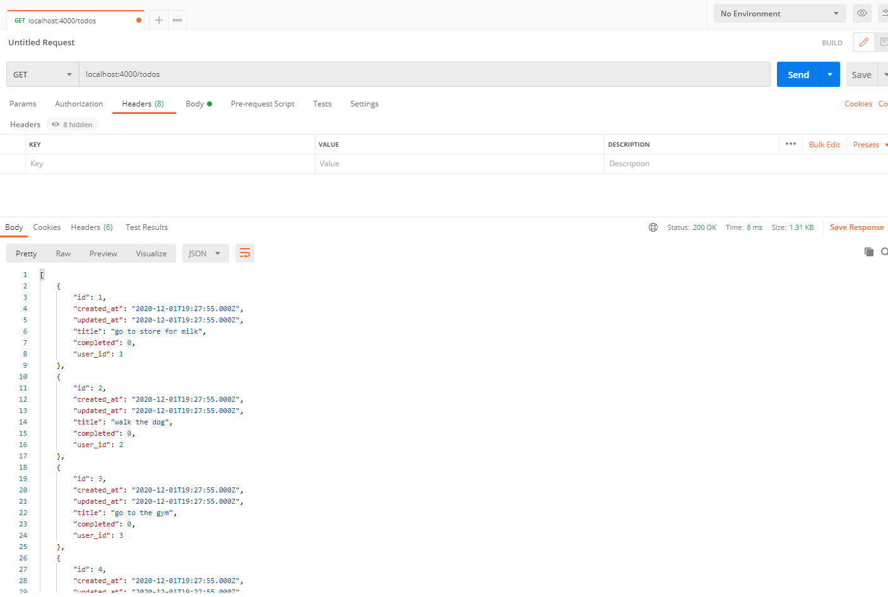
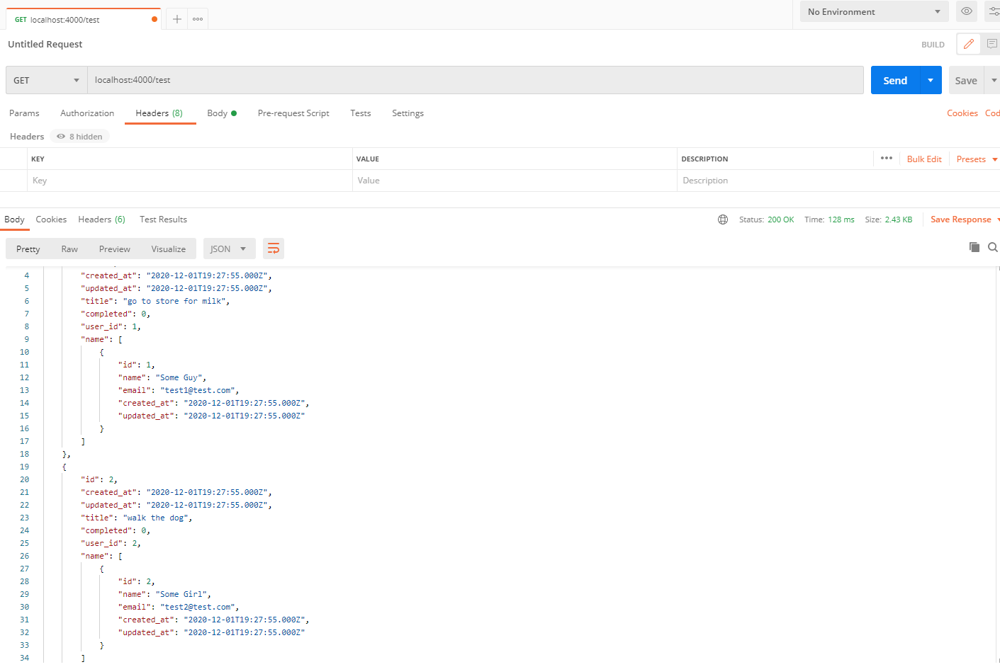
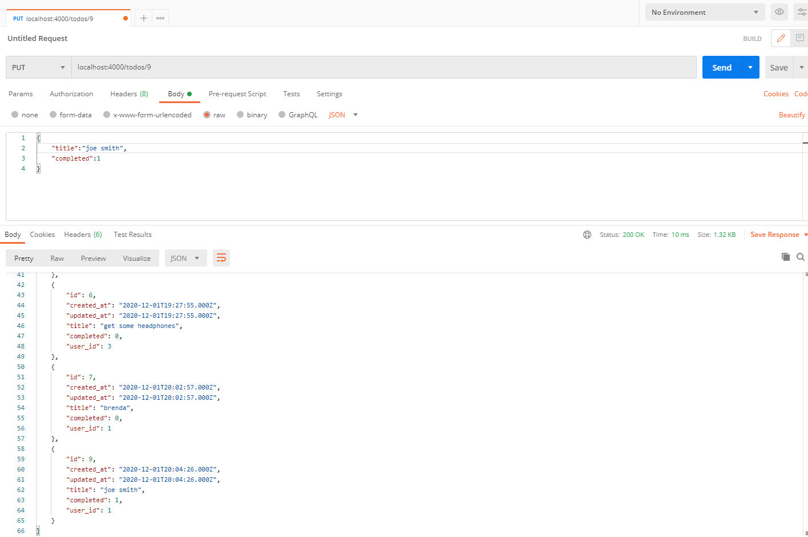

# Knex connect MYSQL database with nodejs-express

port: 4000

```
npm run dev
```

```
npm start
```

videos : check env file

connect mysql:knex.js

commands that had been used :

```
knex init
knex migrate:make migration_name
knex migrate:latest
knex migrate:rollback
```

```
knex seed:run
```

saved at :F:\York University\FS1020-nodejs-express\knex-mysql-practice-connection

screenshots:

1. get todos list
   

2. knex populate todos with users table
   

3. update one item
   
